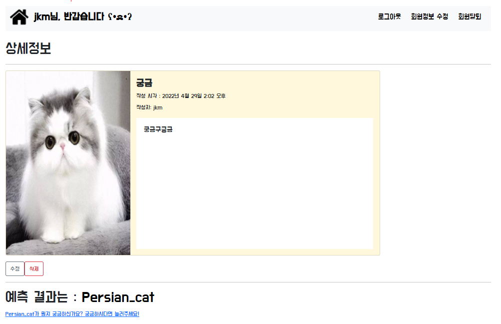

# Predict-Images-On-The-Web


## Introduction


This page is to predict images on the web using keras models.


## Requirements

- Python 
- Django
- ...

## Tutorial

1. ```python -m venv venv```
2. ```source venv/Scripts/activate```
3. ``` pip install -r requirements.txt ```
4. ```python manage.py makemigrations```
5. ```python manage.py migrate```
6. ```python manage.py runserver```
7. http://127.0.0.1:8000/predicts/ 


## 수정 & 추가
1. [0504](./record/0504.md)

## To-do list 

1. ~~detail이 아닌 create 할때 이미지 예측후 모델에 저장하기~~ -> 0504 완료
2. 테마 Nav도 같이 바꾸기 설정 
3. 삭제버튼 누르면 알람후 YES or NO 추가하기 
